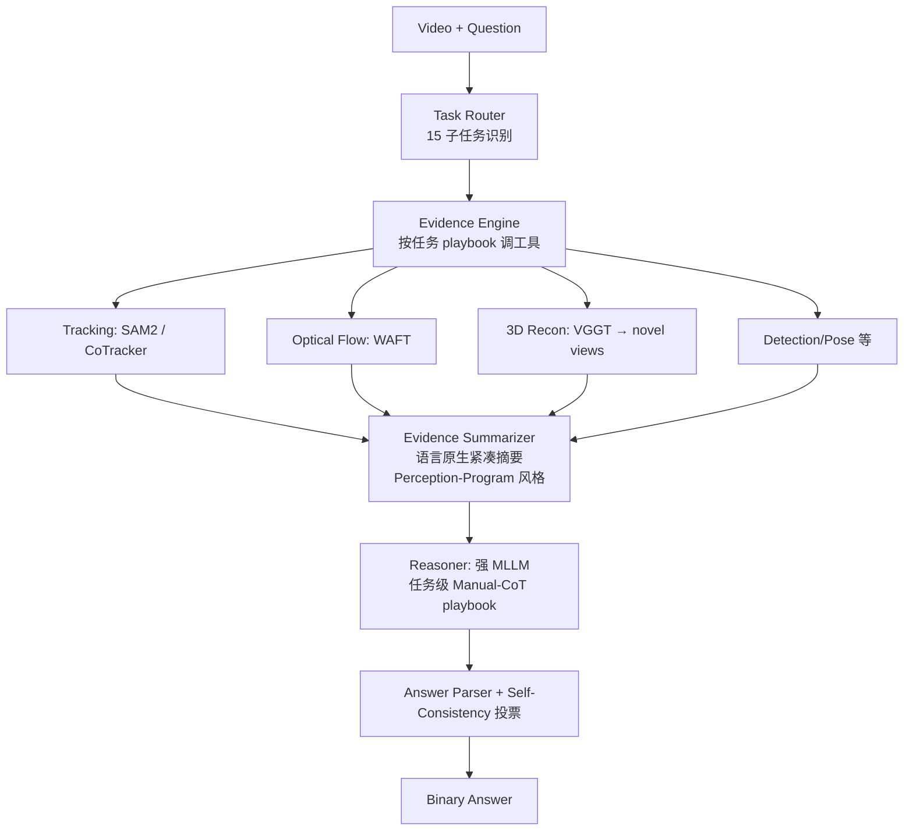

# ADR: Agent 系统架构 — 工具增强 + 证据显式化（ViSTR-Agent v1）

## Context

目标是在 ViSTR-Bench leaderboard 上超过当前榜首 GPT-5.4-thinking（62.0%，人类 91.0%）。
论文实验（见 `docs/knowledge/vistr_bench.md` §5–7）给出了明确证据：

| 配置 | Avg. / 任务 acc | 结论 |
|------|----------------|------|
| Direct → Manual CoT（纯文本推理增强） | 53.6 → 55.2 | 文本 CoT 收益 ≤+1.6，补不了感知短板 |
| VGGT-Ω 重建 + 10 新视角（Ego Motion） | 63.4 → 80.2 | 显式 3D 证据 +16.8 |
| WAFT 光流 + 语言原生摘要（Interaction Dir.） | 78.6 → 83.9 | 显式运动证据 +5.3 |
| 错误分析 | Motion 27.5% / Outcome 24.5% / Tracking 18.3% / Physical 15.8% / Spatial 12.7% | 瓶颈在低层感知与时序证据聚合，不在目标识别（1.2%） |

约束：评测只允许视觉+文本输入（禁止 GT 深度/位姿），但**工具估计**的中间证据合规（论文 IV-F 范式）；只能在 public split 迭代。

## Decision

采用**工具增强的分层 agent 架构（tool-augmented agentic pipeline）**，而不是端到端prompting 或训练路线。四层结构：

1. **Task Router**：按元数据/问题模板映射到 15 个子任务 playbook。
2. **Evidence Engine**：每个子任务有固定的工具组合（按错误类型对症下药）：
   - Motion State（27.5%）→ 光流 + 轨迹定量（Vehicle Movement / Relative Velocity / Rotation / Swimming）
   - Outcome（24.5%）→ 目标跟踪 + 轨迹外推（球类 4 任务 / Fall）
   - Tracking（18.3%）→ SAM2/CoTracker 锁定目标（球类）
   - Physical（15.8%）→ 局部放大 + 接触/支撑分析（Jenga/Mikado/Knot）
   - Spatial（12.7%）→ VGGT 重建 + 新视角（Ego Motion / Passage Feasibility）
3. **Evidence Summarizer**：把工具输出转成紧凑结构化文本摘要（Perception Program 风格），MLLM 只读摘要+关键帧，不直接消化原始工具输出。
4. **Reasoner**：强 MLLM（thinking 模式）+ 任务级 Manual-CoT 模板（论文 Appendix B 为起点），N 次采样多数投票（Self-Consistency 已被论文验证有效）。

## Rationale

- **为什么不做端到端 prompting 调优**：论文证明文本 CoT 天花板 ≈+1.6；收益最大的方向是把任务相关的空间/运动证据**显式化**（+5~+17 量级）。
- **为什么不训练**：空间专用模型（GeoThinker 52.8%≈随机）说明静态空间训练不迁移；我们无训练数据与算力预算，agent 路线零训练、可逐任务迭代。
- **为什么语言原生摘要而不是直接喂工具图**：论文 Interaction Direction 的增益来自摘要化；且 MLLM 对连续时序几乎不利用（ordered≈shuffled 实验），定量摘要绕过这个短板。
- **对齐错误分布定优先级**：工具建设顺序按错误占比排——光流/轨迹（45%+）→ 跟踪（18%）→ 3D 重建（13%）→ 物理分析（16%）。

## Consequences

- 需要在 `third_party/` 接入 VGGT、WAFT、SAM2/CoTracker 等模型（下载需用户确认；ROCm 兼容性需逐个验证，记录到 `docs/knowledge/`）。
- 评测协议固定：public 670 题，per-task + overall accuracy，对照 Chance(Frequency)=57.9% 与 GPT-5.4-thinking=62.0%。
- 每个子任务 playbook（工具组合+prompt 模板）成为独立迭代单元，允许单任务 A/B。
- 每次实验的预测写 `outputs/predictions/*.jsonl`，用 `visualize_results.py` 做 overview + 样本回放 case 分析。
- 风险：单任务增益不保证总体增益（论文 pilot 只验证了 2 个任务）；需先用 baseline 复现 53–62% 区间再叠加工具。
