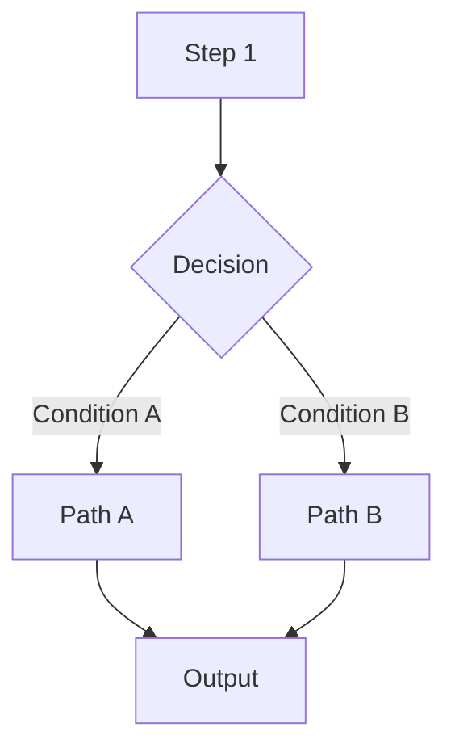

# <Title>

## Purpose

<!-- One or two sentences on what this module/script solves, and what it does NOT handle. -->

## Mental Model

<!-- 5-10 sentences describing how a human should think about this implementation.
     Analogies, core design philosophy, key constraints.
     After reading this, the reader should be able to predict most behavior. -->

## Flow Diagram



## Core Pseudocode

```text
initialize models/state
for each input:
    compute condition
    if condition:
        path A
    else:
        path B
    produce output
finalize
```

## Critical Branches

| Condition | Behavior | Code |
|-----------|----------|------|
| `condition_a` | Takes path A, uses model X | `file.py:L42` |
| `condition_b` | Takes path B, uses model Y | `file.py:L58` |
| error/fallback | Uses cached value | `file.py:L70` |

## Data Contracts

### Input

| Field | Type | Source | Description |
|-------|------|--------|-------------|
| ... | ... | ... | ... |

### Intermediate State

| Field | Type | Lifecycle | Description |
|-------|------|-----------|-------------|
| ... | ... | ... | ... |

### Output

| Field | Type | Destination | Description |
|-------|------|-------------|-------------|
| ... | ... | ... | ... |

## Invariants

- ...
- ...

## Side Effects

- Which directories/files are written
- Whether external services are called
- Whether GPU / large memory is consumed
- Whether existing files are overwritten

## Change Impact

| Modification | Affected scope |
|--------------|----------------|
| Change threshold | ... |
| Replace model | ... |
| Change output format | ... |

## Code Pointers

| Symbol | Path | Role |
|--------|------|------|
| `ClassName.method` | `path/file.py:L42` | Brief description |
| `function_name` | `path/other.py:L10` | Brief description |
