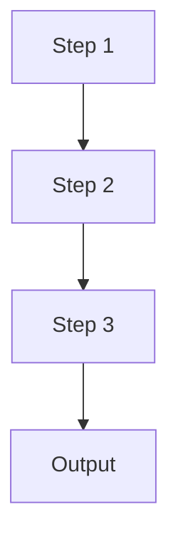

# <Title>

## Purpose

<!-- One or two sentences on what this module/script solves, and what it does NOT handle. -->

## Flow Diagram



## Core Pseudocode

```text
step 1: ...
step 2: ...
step 3: ...
output: ...
```

## Code Pointers

| Symbol | Path | Role |
|--------|------|------|
| `ClassName.method` | `path/file.py:L42` | Brief description |
| `function_name` | `path/other.py:L10` | Brief description |
