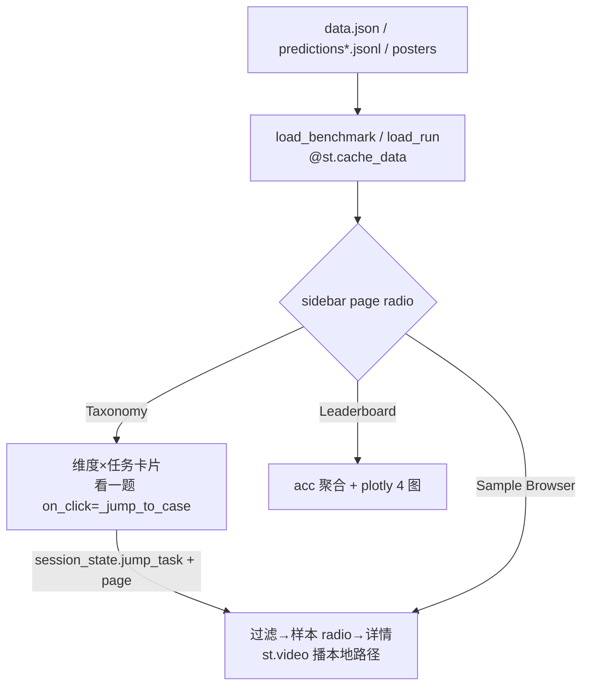

# Code Map: vistr_viewer.py（Streamlit 前端）

## Purpose

ViSTR-Bench 的 Web 查看器：Taxonomy（任务分类总览）、Leaderboard（预测结果 vs 论文参照）、
Sample Browser（逐样本视频+判定回放）。不做任何评测/推理，只读 `data.json`、
`outputs/predictions/*.jsonl` 与 `web/posters/`。

## Flow Diagram



## Core Pseudocode

```text
页面路由: st.sidebar.radio(key="page")，三页函数分发
Taxonomy:  遍历 DIMS → 每任务卡片（poster+计数+答案分布）；
           「看一题」= on_click 回调写 jump_task/page（widget 实例化后同 run 不可改 state，必须回调）
Browser:   filt_key=(run,task,status,query) 变化或 jump 到达时重置 browser_idx（jump 时随机）；
           「换一题」on_click 随机 browser_idx；详情列 st.video(绝对路径) + 选项高亮 + verdict
Leaderboard: per-task/per-dim acc 聚合 → plotly bars/heatmap，参照行内置常量 REFERENCE
```

## Code Pointers

| Symbol | Path | Role |
|--------|------|------|
| `load_benchmark` | `scripts/vistr_viewer.py:84` | benchmark GT 伪 run（task 下划线→空格） |
| `load_run` | `scripts/vistr_viewer.py:103` | 预测 JSONL 加载（cache） |
| `page_taxonomy` | `scripts/vistr_viewer.py:138` | 分类页；`_jump_to_case` 回调跳转 |
| `page_leaderboard` | `scripts/vistr_viewer.py:175` | 4 图 + bias 监控 |
| `page_browser` | `scripts/vistr_viewer.py:258` | 过滤/选择状态机 + 详情渲染 |
| `REFERENCE` | `scripts/vistr_viewer.py:48` | 论文全集参照（Table II 子集） |
