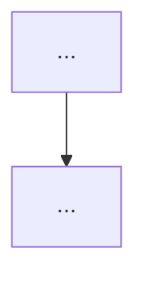

# SpatialClaw 作为 ViSTR-Bench Harness

## User Goal

> Written by the user. Can be informal, any language, incomplete.
> Agent must NOT delete, overwrite, or alter this section.

背景：之前尝试了自己以"qwen3-vl-plus"作为agent后端，自己设计一套toolkit作为harness的系统，结果发现提升有限。因此我们转念一想，何不基于现在已经有的harness框架呢？

其中我们决定用nvidia家的spatialclaw作为harness（git@github.com:NVlabs/SpatialClaw.git），这是一个面向3D task的harness框架

### 第一阶段
先以"qwen3-vl-plus"作为agent后端，以原生的spatial claw作为harness，跑一下结果

## For Agent: Execution Protocol

1. Read and follow `docs/agent/always.md`.

2. Based on **User Goal**, fill in:
   - `Agent Refined Plan`
   - `Required Agent Resources`
   - `Acceptance Criteria`

3. To find available Rules, Skills, or Playbooks, check:
   - `docs/registry/agent_system.md`
   - Do not load everything — only what's relevant.

4. When refining:
   - User Goal is the highest source of truth.
   - Do not omit any explicit user requirement.
   - Do not expand scope beyond what was asked.
   - Non-blocking side issues: note them, don't pursue them.
   - If there's ambiguity, danger, or high cost: ask the user first.

5. After implementation and verification, fill in the **Execution Report**.

6. Before user approval:
   - Set status to `awaiting_approval`, not `completed`.
   - Do not archive the plan.
   - Do not describe experimental results as final conclusions.

7. After user approval, complete this **archival checklist** (do not skip):
   - [ ] Update status to `completed`, move to `plans/completed/`.
   - [ ] Update `docs/working_logs/active.md`.
   - [ ] **Register new assets**: new scripts → `registry/scripts.md`; new data/outputs → `registry/outputs.md` or `registry/datasets.md`.
   - [ ] **Register new agent resources**: new rules/skills/playbooks → `registry/agent_system.md`.
   - [ ] If document structure changed, update `docs/README.md`.
   - [ ] If an experiment was run, write a run log to `working_logs/runs/`.
   - [ ] **Evaluate Code Map**: per `rule:human-code-review`, decide if this implementation needs a new or updated `docs/code_maps/` document.

## Agent Refined Plan

### Understanding

用 NVIDIA SpatialClaw（code-as-action 空间推理框架）替代自建 harness，以 qwen3-vl-plus (AMAP gateway) 为 agent 后端，在 ViSTR-Bench 上跑评测。

SpatialClaw 架构：Planning → Code Generation → Jupyter Kernel Execution → Feedback → Reflection loop。VLM 在 persistent kernel 里写 Python，调用感知工具（Reconstruct/SAM3/Geometry 等），逐步分析后输出答案。

第一阶段：原生 SpatialClaw + qwen3-vl-plus，不改 agent 逻辑，只加 ViSTR-Bench 数据加载器。

### Scope

#### In Scope

- 安装 SpatialClaw agent 依赖（不需要 vLLM server，用外部 API）
- 写 ViSTR-Bench benchmark loader（继承 BaseBenchmark + VideoFrameBenchmarkMixin）
- 配置 qwen3-vl-plus model config（AMAP gateway OpenAI-compatible）
- 配置 dataset config（vistrbench.json）
- 跑 dev split 评测，记录结果
- 尝试启动 GPU server（Reconstruct/SAM3），如硬件不支持则 CPU-only 工具

#### Out of Scope

- 修改 SpatialClaw agent 逻辑
- 修改 prompt/system message
- 训练/微调任何模型
- Private held-out set

### Steps

1. 检查环境：Python 版本、GPU、依赖兼容性
2. 安装 SpatialClaw agent 依赖（requirements-agent.txt）
3. 创建 ViSTR-Bench benchmark loader `spatial_agent/evals/vistrbench.py`
4. 注册到 `BENCHMARK_REGISTRY`
5. 创建 model config `spatial_agent/config/model/qwen3-vl-plus.json`
6. 创建 dataset config `spatial_agent/config/dataset/vistrbench.json`
7. Smoke test: 5 samples
8. 全量 dev split 评测（403 samples）

## Required Agent Resources

### Rules

- `rule:safety` → `docs/agent/rules/safety.md`

### Skills

- N/A

### Playbooks

- N/A

## Acceptance Criteria

- [ ] SpatialClaw agent 依赖安装成功
- [ ] ViSTR-Bench loader smoke test 通过（5 samples）
- [ ] Dev split 全量评测完成，结果写入 run log
- [ ] 与自建 harness 结果对比（55.6% plus V4）

---

## Execution Report

### Summary

- ...

### Changed Files

| File | Change |
|------|--------|

### Commands

```bash
# Key commands executed
```

### Verification Results

```text
# Output and conclusions
```

### Outputs

- ...

### Remaining Issues

- ...

### Human Review Guide

#### What changed conceptually

- ...

#### Execution flow



#### Core pseudocode

```text
...
```

#### Key code pointers

* `path/file.py:function_name`

#### Code maps created/updated

* (link to new or updated code map, or N/A)

### Suggested Next Step

- ...
