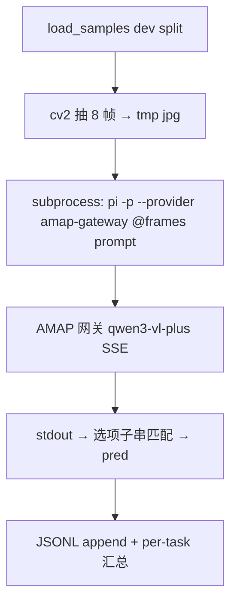

# pi 作为新 harness — Stage 1 拉通

## User Goal

> Written by the user. Can be informal, any language, incomplete.
> Agent must NOT delete, overwrite, or alter this section.

我们决定spatial claw作为harness还是太死板局限。我们决定使用pi作为我们的新baseline；（https://github.com/earendil-works/pi）

pi它毕竟是个coding agent的产品，主要还是用ts写的，需要和我们的评测任务做下适配。

本计划是第一阶段，能正常的回答问题即可，现阶段没必要实现sandbox.

## For Agent: Execution Protocol

1. Read and follow `docs/agent/always.md`.

2. Based on **User Goal**, fill in:
   - `Agent Refined Plan`
   - `Required Agent Resources`
   - `Acceptance Criteria`

3. To find available Rules, Skills, or Playbooks, check:
   - `docs/registry/agent_system.md`
   - Do not load everything — only what's relevant.

4. When refining:
   - User Goal is the highest source of truth.
   - Do not omit any explicit user requirement.
   - Do not expand scope beyond what was asked.
   - Non-blocking side issues: note them, don't pursue them.
   - If there's ambiguity, danger, or high cost: ask the user first.

5. After implementation and verification, fill in the **Execution Report**.

6. Before user approval:
   - Set status to `awaiting_approval`, not `completed`.
   - Do not archive the plan.
   - Do not describe experimental results as final conclusions.

7. After user approval, complete this **archival checklist** (do not skip):
   - [ ] Update status to `completed`, move to `plans/completed/`.
   - [ ] Update `docs/working_logs/active.md`.
   - [ ] **Register new assets**: new scripts → `registry/scripts.md`; new data/outputs → `registry/outputs.md` or `registry/datasets.md`.
   - [ ] **Register new agent resources**: new rules/skills/playbooks → `registry/agent_system.md`.
   - [ ] If document structure changed, update `docs/README.md`.
   - [ ] If an experiment was run, write a run log to `working_logs/runs/`.
   - [ ] **Evaluate Code Map**: per `rule:human-code-review`, decide if this implementation needs a new or updated `docs/code_maps/` document.

## Agent Refined Plan

### Understanding

用 pi（earendil-works/pi，TypeScript coding agent，npm 包 `@earendil-works/pi-coding-agent`）
替代 SpatialClaw 作为新 harness。Stage 1 只要求"能正常回答问题"：视频抽帧 → `pi -p`
print 模式带图提问 → 解析答案 → 打分。不实现 sandbox / 工具执行。

可行性调研结论（2026-08-06）：
- `pi -p @img.jpg "prompt"` 支持无头单发问答 + 图片附件；另有 `--mode json` / `--mode rpc` 供后续阶段使用
- 自定义 OpenAI 兼容端点通过 `~/.pi/agent/models.json` 配置（baseUrl + api: openai-completions + input: [text, image]）
- 运行时要求 Node ≥22.19.0，本机 v22.23.1 满足，无需 Bun
- AMAP 网关已验证支持 SSE 流式（pi 走流式调用的前提）

### Scope

#### In Scope

- 项目内局部安装 pi（`third_party/pi-runtime/`，npm local install）
- `~/.pi/agent/models.json` 配置 amap-gateway provider（qwen3-vl-plus，text+image，compat 关闭 developer role / reasoning_effort）
- `agent/eval_pi.py`：复用 eval_baseline.py 骨架（load_samples、cv2 抽 8 帧、选项子串匹配、JSONL + resume、per-task 汇总），模型调用换成 subprocess 调 `pi -p`
- 冒烟验证：单图问答 + 5~10 个 dev 样本跑通

#### Out of Scope

- sandbox / 工具执行（stage 2+）
- 全量 dev(403) 评测（跑通后需用户确认再跑）
- pi extensions / 自定义 provider 代码
- SpatialClaw 清理

### Steps

1. 验证网关 `stream: true`（pi 依赖 SSE）✅
2. `third_party/pi-runtime/` 下 npm 局部安装 pi
3. 从 `agent/llm_keys.local.json` 生成 `~/.pi/agent/models.json`（chmod 600，key 不入 repo）
4. `pi -p @frame.jpg` 单图冒烟
5. 编写 `agent/eval_pi.py`，跑 5~10 个 dev 样本验证输出与打分
6. 填写 Execution Report，status → awaiting_approval

## Required Agent Resources

### Rules

- `docs/agent/always.md`（key 安全、public split only、后台 -u、run log）

### Skills

- 无

### Playbooks

- 无

## Acceptance Criteria

- [ ] `pi -p` 带图问答返回可解析文本（走 AMAP 网关 qwen3-vl-plus）
- [ ] `agent/eval_pi.py --limit 5` 跑通：无报错、JSONL 输出、pred 解析正确
- [ ] API key 未进入 git（models.json 在 ~/.pi 下且 600 权限）
- [ ] 每样本耗时在可接受范围（< 2 min/样本）

---

## Execution Report

### Summary

- pi v0.84.0 局部安装于 `third_party/pi-runtime/`（npm，Node 22.23.1 直接运行，无需 Bun）
- AMAP 网关验证支持 SSE 流式；`~/.pi/agent/models.json` 配置 amap-gateway provider（qwen3-vl-plus, text+image, chmod 600）
- 新脚本 `agent/eval_pi.py`：抽帧 → `pi -p @frames "prompt"` 子进程 → 选项匹配打分，复用 baseline 的数据加载/JSONL/resume/汇总
- 冒烟 5 样本全部跑通，输出干净（模型直接回 "Yes"/"No"），27.3s/样本

### Changed Files

| File | Change |
|------|--------|
| `agent/eval_pi.py` | 新增：pi harness 评测脚本 |
| `third_party/pi-runtime/` | 新增：pi npm 局部安装（package.json + node_modules） |
| `~/.pi/agent/models.json` | 新增（repo 外）：amap-gateway provider 配置，含 key，600 权限 |

### Commands

```bash
# 安装
cd third_party/pi-runtime && npm install @earendil-works/pi-coding-agent  # v0.84.0

# 单图冒烟
third_party/pi-runtime/node_modules/.bin/pi -p --provider amap-gateway \
  --model qwen3-vl-plus @frame.jpg "这张图里是什么运动场景?一句话回答。"

# 评测冒烟
/opt/conda/bin/python -u agent/eval_pi.py --limit 5 \
  --output outputs/predictions/pi_smoke_test.jsonl
```

### Verification Results

```text
网关流式: HTTP 200, content-type: text/event-stream ✅
pi --version: 0.84.0 ✅
单图问答: "这是一个人在户外篮球场上运球的场景。" ✅
eval_pi.py --limit 5 (Basketball_Shot):
  5/5 跑通, raw_answer 均为干净的 "Yes", 解析正确
  2/5 correct (模型全答 Yes; gt 3 No / 2 Yes)
  27.3s/样本 (baseline 直连 API 约 8-15s, pi 有 agent loop 开销)

全量 dev (403, 用户确认后, --workers 4):
  220/403 = 54.6%, 0 errors, 36 min
  vs 裸 API baseline 50.6% (+4pp), vs V4 tools 55.6% (-1pp)
  详见 run log: docs/working_logs/runs/2026-08-06_pi_stage1_dev.md
```

### Outputs

- `outputs/predictions/pi_smoke_test.jsonl`（5 条冒烟记录）

### Remaining Issues

- **"Yes" bias**：5 样本全答 Yes（直连 baseline 是 "No" bias）——pi 的 coding-agent system prompt 改变了模型行为，需全量跑后再评估
- 每样本 ~27s，403 样本全量约 3 小时（串行）；可考虑多进程并行
- pi 每次调用带自身 system prompt，token 开销大于裸 API
- `pi -p` 默认仍会保存 session 到 `~/.pi/agent/sessions/`，长期跑量大时需清理

### Human Review Guide

#### What changed conceptually

- harness 从 SpatialClaw（Planning→CodeGen→Jupyter）换为 pi（通用 coding agent，print 模式）
- Stage 1 pi 仅作"带图问答通道"，未启用其工具/代码执行能力（stage 2+ 再接）

#### Execution flow



#### Core pseudocode

```text
for sample in dev_split:
    frames = extract_8_frames(sample.video)         # 640x360 jpg q65
    cmd = [pi, -p, --provider amap-gateway, --model qwen3-vl-plus,
           @frame_00.jpg ... @frame_07.jpg, PROMPT(question, options)]
    answer = run(cmd, cwd=tmpdir).stdout
    pred = first option whose text ⊆ answer (case-insensitive)
    write jsonl(id, gt, pred, correct, raw_answer, elapsed)
```

#### Key code pointers

* `agent/eval_pi.py:solve_pi` — 抽帧 + pi 子进程调用 + 解析
* `agent/eval_pi.py:_extract_frames` — 帧提取（同 baseline 参数）
* `agent/eval_baseline.py:load_samples` — 复用的数据加载
* `~/.pi/agent/models.json` — provider 配置（repo 外，含 key）

#### Code maps created/updated

* N/A（单脚本，结构与 eval_baseline.py 一致，暂不需要）

### Suggested Next Step

- 用户批准后归档本计划,再确认是否跑全量 dev(403) 建立 pi baseline（预计 ~3h 串行，建议加并行）
- Stage 2：启用 pi 的工具能力（bash/read）+ 视频帧目录作为工作区，让其自主探索帧

