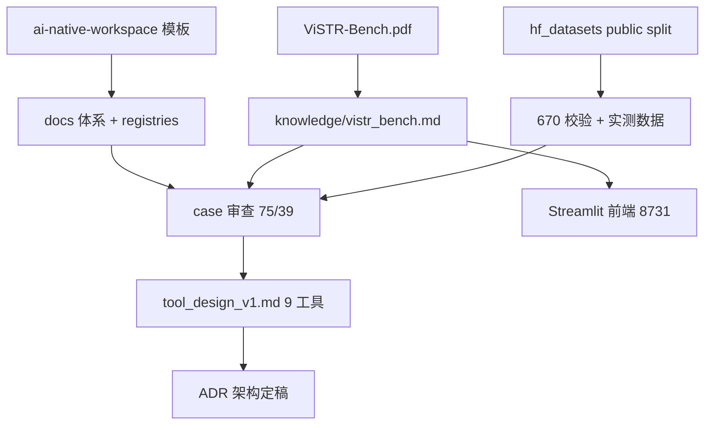

# ViSTR-Agent v1：Baseline 复现 + 工具链建设

## User Goal

> 看下ai-native-workspace，我们想设计个agent系统打ViSTR-Bench.pdf这个榜（pdf也在本仓下的references里）你先初始化咱的文档体系，然后你写个可视化前端（前端的skills复用 0701-monocular_pose_estimation 里的规范就行）

## For Agent: Execution Protocol

按 `docs/agent/always.md` 执行；完成后按模板归档清单归档。

## Agent Refined Plan

### Understanding

搭建打 ViSTR-Bench 榜的 agent 系统。架构已定（ADR：工具增强+证据显式化）。v1 的目标是先复现 baseline 确认评测链路正确，再按错误占比优先级逐任务叠加工具证据。文档体系与可视化前端本次已完成。

### Scope

#### In Scope

- 文档体系初始化（CLAUDE.md / AGENTS.md / docs/，含 knowledge、ADR、registries）
- 可视化前端（overview dashboard + 样本回放，复用 0701 规范）
- 下一步：benchmark 数据下载、baseline 评测管线、工具链接入

#### Out of Scope

- 模型训练 / 微调
- private held-out set 任何形式的调参
- 大规模集群评测（每次需用户确认）

### Steps

1. ~~初始化文档体系~~（本次完成）
2. ~~写 knowledge/vistr_bench.md + ADR + 可视化前端~~（本次完成）
3. ~~下载 ViSTR-Bench public split~~（2026-08-01 确认已在 `hf_datasets/ViSTR-Bench-Public`，项目内软链就位，670 样本 0 缺失）
4. Baseline：direct prompting + 1 个强 MLLM，public 670 题，验证 acc 落在论文区间（53–62%）并写 run log
5. 工具链 v1：WAFT 光流 + 摘要 → Motion Perception 类任务 A/B
6. 工具链 v2：SAM2/CoTracker 跟踪 + 轨迹外推 → Outcome Prediction 球类任务 A/B
7. 工具链 v3：VGGT 新视角 → Ego Motion / Passage Feasibility A/B（论文已验证 +16.8）

## Required Agent Resources

### Rules

- `rule:safety` → `docs/agent/rules/safety.md`

### Skills

- `skill:visualize` → `docs/agent/skills/visualize_benchmark_results/SKILL.md`
- `skill:report` → `docs/agent/skills/report_generation/SKILL.md`

### Knowledge

- `knowledge:vistr-bench` → `docs/knowledge/vistr_bench.md`
- `adr:tool-augmented-arch` → `docs/adr/2026-07-31_tool_augmented_agent_architecture.md`

## Acceptance Criteria

- [x] 文档体系从模板初始化，占位符全部替换，registry 反映当前资产
- [x] `docs/knowledge/vistr_bench.md` 覆盖任务/榜单/错误分析/改进方向
- [x] ADR 记录架构决策
- [x] 可视化前端冒烟通过（Streamlit 三页 AppTest 0 异常）
- [x] benchmark 数据就位（2026-08-01：`hf_datasets/ViSTR-Bench-Public`，670 样本校验通过）
- [x] （新增）逐 case 审查 + 工具设计分析报告 → `docs/knowledge/tool_design_v1.md`
- [ ] ~~baseline 复现并写 run log~~ → 移交 `plans/active/2026-08-01-baseline-and-toolchain-v1.md`
- [ ] ~~工具链 v1–v3~~ → 移交同上

---

## Execution Report

### Summary

- 完成：文档体系初始化、benchmark 知识沉淀（含 public split 实测）、架构 ADR、
  双前端（静态渲染 + Streamlit Web）、逐 case 审查（75 抽样/39 实看留档）、
  9 工具设计报告（已 promote `docs/knowledge/tool_design_v1.md`）。
- 移交：baseline 复现、工具链 v1–v3 → 后续 plan。

### Changed Files

| File | Change |
|------|--------|
| `CLAUDE.md`, `AGENTS.md` | 项目入口（模板填充） |
| `docs/agent/always.md` | 项目化核心规则 |
| `docs/registry/*.md` | 资产/资源索引 |
| `docs/knowledge/vistr_bench.md` | 论文摘要 + public 实测 |
| `docs/knowledge/tool_design_v1.md` | 工具设计报告（promoted） |
| `docs/adr/2026-07-31_tool_augmented_agent_architecture.md` | 架构决策 |
| `visualize_results.py`, `scripts/visualize.sh` | 静态可视化前端 |
| `scripts/vistr_viewer.py`, `scripts/web_frontend.sh` | Streamlit Web 前端（8731） |
| `web_frontend.py` | stdlib 方案，已 DEPRECATED |
| `scripts/{extract_case_frames,case_log_append,gen_task_posters}.py` | case 审查工具 |
| `docs/notes/analyses/2026-08-01_case_review/` | case 留档（75 拼图+39 日志） |
| `docs/code_maps/scripts/vistr_viewer.md` | 前端 code map |

### Commands

```bash
bash scripts/web_frontend.sh            # Streamlit @8731
bash scripts/visualize.sh --demo        # 静态前端冒烟
/opt/conda/bin/python scripts/extract_case_frames.py --n_per_task 5
```

### Verification Results

- `runs/2026-07-31_visualizer_smoke.md`（静态前端）
- `runs/2026-08-01_web_frontend_smoke.md` / `2026-08-01_web_video_fix_taxonomy.md` / `2026-08-01_streamlit_rewrite.md`（Web 前端三轮）
- benchmark 校验：670 样本 0 缺失（见 datasets.md）

### Remaining Issues

- baseline 未跑（等 reasoner 底座决策：本地 Qwen3-VL/InternVL3 vs API）
- user-site numpy 2.2.6 遮蔽 conda base numpy 1.26.4（影响 vggt 后续接入；独立 env 待建）
- 静态前端 `visualize_results.py` 仍依赖 base+user-site 环境

### Human Review Guide

#### What changed conceptually

- 从零搭建：文档体系 → 数据校验 → 可视化双前端 → 逐 case 人工审查 → 工具设计定稿。

#### Execution flow



#### Core pseudocode

```text
无核心算法（本 plan 为基建+调研）；前端见 code_maps/scripts/vistr_viewer.md
```

#### Key code pointers

* `scripts/vistr_viewer.py`（Web 前端主入口）
* `visualize_results.py`（静态渲染）
* `docs/knowledge/tool_design_v1.md`（后续实施依据）

#### Code maps created/updated

* `docs/code_maps/scripts/vistr_viewer.md`（新建）

### Suggested Next Step

- 执行 `plans/active/2026-08-01-baseline-and-toolchain-v1.md`：先定 reasoner 底座跑 baseline。
